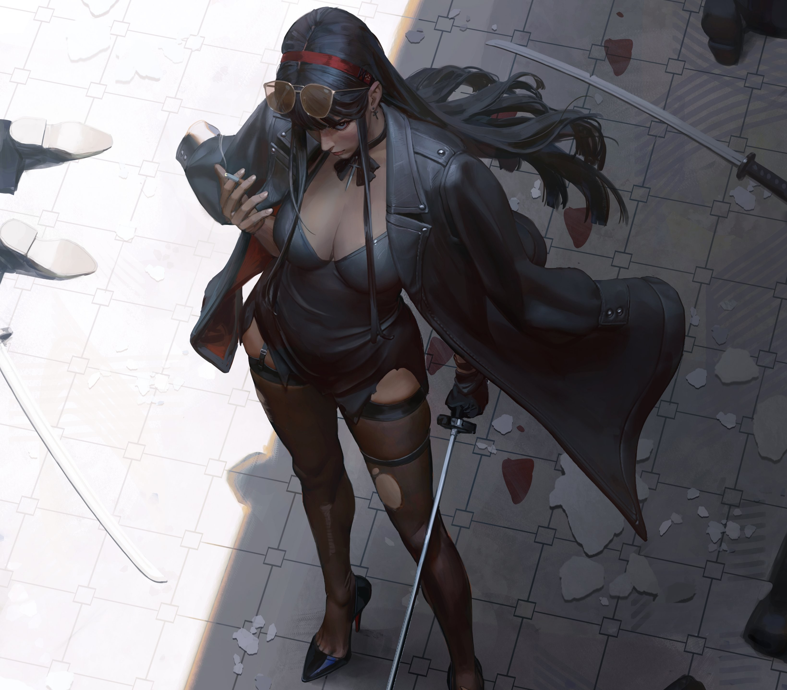

  

# ❀⋅˚₊ ‧ ୨୧ About Me . . .ᐟ
- 🪼 My name is Anais Polett Rodríguez Carvajal.
- 🪼 I am 22 years old.
- 🪼 I am from Chile.
- 🪼 I'm a fourth-year Civil Engineering student specializing in Computing and Informatics.
- 🪼 I enjoy creativity and art.
- 🪼 I originally studied mechanics with the goal of building robots.
- 🪼 I love lilies.

 ⋅˚₊ ‧  

⋅ ₊˚‧ 

## 🪻 Main Languages & Tools 🪻

## 🌱  Tech Stack:
                                 

<table align="center">
  <tr>
    <td align="center" valign="middle">
      
    </td>
    <td align="center" valign="middle">
      <strong><em>If you want to know more about me, feel free to contact me!</em></strong>
    </td>
  </tr>
</table>

---

  

